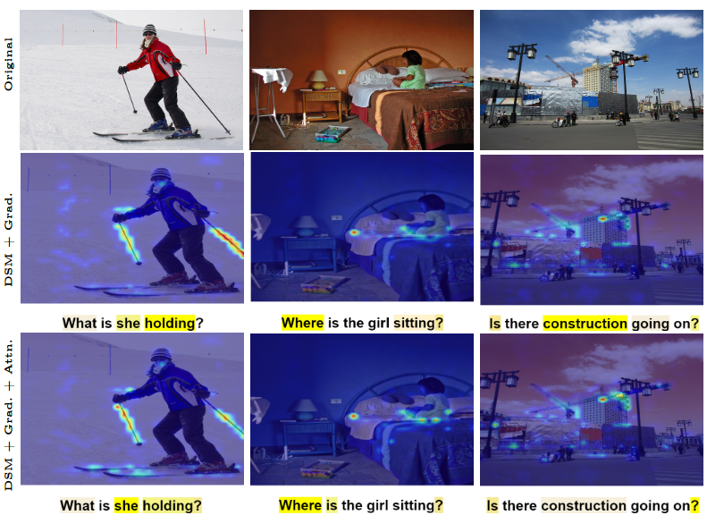

# Interpretable Visual Semantic Alignment via Spectral Attribution

Our work specifically focuses on generating visual explanations of both the image modality and the text modality using concepts from graph spectral theory by solving the characteristic equation of the Laplacian for models that are fine-tuned on the VQA downstream task. Our method is model-agnostic to some extent and post-hoc, capable of generating local explanations catering to each image-question pair provided for inference.
The job of our interpretability module is to highlight the regions of image and text (question) that contribute to the model’s decision/answer. We propose the following list of contributions for interpretability of bi-modal models:
1. **Class-agnostic version (Deep Spectral Methods for Interpretability - DSMI):** The first is the direct application of graph spectral theory which is unsupervised in nature

2. **Class-specific version (DSMI + Grad):** In order to explain the decision of the bi-modal models, we modeled the spectral approach like GradCAM, where "CAM" represents the fiedler eigenvectors generated by the standard spectral approach which are much more robust than pure attention maps

3. **Class-specific and Transformers-specific version (DSMI + Grad + Attn):** In combination with the gradients based spectral approach, we utilise the attention maps for transformer specificit


## Demo

```bash
git clone https://github.com/shiv2110/METER-spectral-interpretability.git
cd METER-spectral-interpretability
pip install -r requirements.txt
```

### Download Pre-trained Checkpoint

Here are the pre-trained models:
METER-CLIP16-RoBERTa fine-tuned on VQAv2 (resolution: 576^2) [meter_clip16_288_roberta_vqa.ckpt](https://github.com/zdou0830/METER/releases/download/checkpoint/meter_clip16_288_roberta_vqa.ckpt)

```bash
 python demo_vqa_ours.py with num_gpus=0 load_path=<path_to_ckpt_file> test_only=True method_name=<interpretability_method> img=<image_path> question=<question>
```

### Visualisation of explanations provided by DSMI variants on LXMERT





## Running Perturbation Tests

Download VQA 2.0 validation dataset

https://visualqa.org/download.html

Download COCO [2014 val images](http://images.cocodataset.org/zips/val2014.zip), , annotations ([val](https://s3.amazonaws.com/cvmlp/vqa/mscoco/vqa/v2_Annotations_Val_mscoco.zip)), and questions ([val](https://s3.amazonaws.com/cvmlp/vqa/mscoco/vqa/v2_Questions_Val_mscoco.zip))

    root
    ├── val2014              
    |   ├── COCO_val2014_000000000042.jpg
    |   └── ...  
    ├── v2_OpenEnded_mscoco_val2014_questions.json
    └── v2_mscoco_val2014_annotations.json

Download valid.json
```bash
cd data/vqa
wget https://nlp.cs.unc.edu/data/lxmert_data/vqa/valid.json
```

Running positive image perturbation test
```bash
python perturbation.py with COCO_path=<COCO_path> method_name=<method_name> is_positive_pert=True modality="image" test_type="positive"
```

Running negative image perturbation test
```bash
python perturbation.py with COCO_path=<COCO_path> method_name=<method_name> is_positive_pert=False modality="image" test_type="negative"
```

Running positive text perturbation test
```bash
python perturbation.py with COCO_path=<COCO_path> method_name=<method_name> is_positive_pert=True modality="text" test_type="positive"
```

Running negative text perturbation test
```bash
python perturbation.py with COCO_path=<COCO_path> method_name=<method_name> is_positive_pert=False modality="text" test_type="negative"
```

AUC scores for perturbations tests on METER: Lower AUC for positive tests and higher AUC for negative tests indicates better performance

| Method                                       | Image ve+                 | Image ve-                | Text ve+                | Text ve-                |
|----------------------------------------------|---------------------------|--------------------------|--------------------------|--------------------------|
| Hila Chefer Relevance Maps                           | 55.27                 | 82.97                | 31.70                | 61.33                |
| Transformer Attribution w/o LRP              | 55.26                   | 82.96                | 31.72                | 61.29                |
| Raw Attention                                | 55.33                     | 82.49                    | 36.72                    | 54.41                    |
| Grad-CAM                                 | 70.95                     | 73.52                    | 49.21                    | 49.83                    |
| Rollout                                  | 59.96                     | 82.17                    | 44.32                    | 49.93                    |
| DSMI                         | 60.07                     | 79.47                    | 45.14                    | 48.05                    |
| DSMI + Grad                  | 54.45                 | 82.93                  | 34.75                  | 57.64                  |
| DSMI + Grad + Attn      | 55.45                     | 82.45                    | 40.37                    | 52.38                    |


## Credits

- Implementation of baselines is based on [Relevance Maps](https://github.com/hila-chefer/Transformer-MM-Explainability)
- Core DSMI implementation is based on [Deep Spectral Methods for unsupervised localisation and segmentation](https://github.com/lukemelas/deep-spectral-segmentation)
- Implementation of METER is based on [METER](https://github.com/zdou0830/METER)


